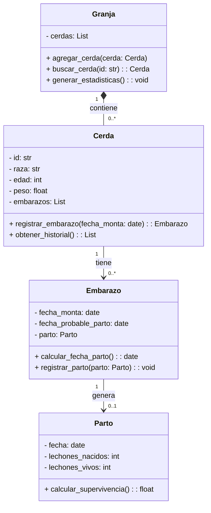

## Requisitos funcionales

### R1 – Registrar nueva cerda
Permite registrar una cerda con su ID, raza, edad y peso, validando que el ID no esté duplicado.

### R2 – Registrar embarazo
Permite registrar la fecha de monta de una cerda y calcular automáticamente la fecha probable de parto (114 días).

### R3 – Registrar parto
Permite registrar el parto de una cerda con el número de lechones nacidos y vivos.

### R4 – Consultar historial
Permite visualizar el historial completo de embarazos y partos de una cerda.

### R5 – Generar estadísticas
Permite calcular el promedio de lechones por parto y la tasa de supervivencia.


## Estructura del proyecto

```
granja/
│
├── cerda.py
├── embarazo.py
├── parto.py
├── granja.py
├── main.py
```

---

## Diagrama de clases (UML)



---
